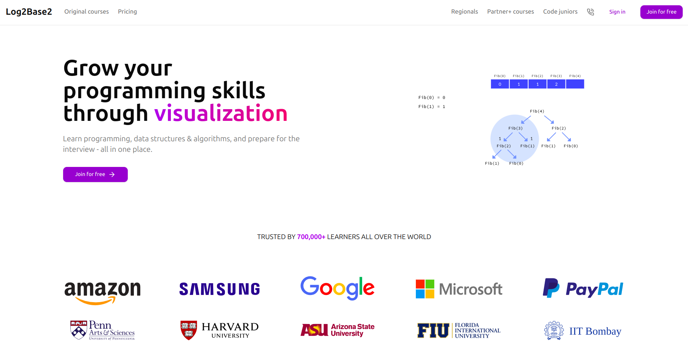

# Log2Base2 Learning Platform 🌐

A modern web platform for programming education and skill development, built with **React.js**, **TypeScript**, and **Tailwind CSS**.

---

## ✨ Features

- Interactive course catalog covering:
  - Data Structures & Algorithms
  - Python Programming
  - Interview Preparation
  - Front-end Development
  - Selenium Testing
  - C Programming & Pointers
- **Responsive Design**: Seamless experience across devices.
- **Modern UI**: Built with Tailwind CSS and Lucide React icons.
- **Customizable**: Flexible components for easy updates.

---

## 🔧 Tech Stack

- **Framework**: React.js  
- **Language**: TypeScript  
- **Styling**: Tailwind CSS  
- **UI Components**: Lucide React icons  
- **Design Approach**: Mobile-first and fully responsive  

---

## 🚀 Getting Started

1. Clone the repository:
   ```bash
   git clone https://github.com/iamnas/log2base2.git
   cd log2base2
   ```

2. Install dependencies:
   ```bash
   npm install
   # or
   yarn install
   ```

3. Start the development server:
   ```bash
   npm run dev
   # or
   yarn dev
   ```

4. Open [http://localhost:3000](http://localhost:3000) to view the application.

---

## 📱 Responsive Design

The platform is optimized for:
- **Mobile devices**
- **Tablets**
- **Desktops**
- **Large screens**

---

## 🖼️ Demo Screenshot

Here’s a preview of the Log2Base2 platform:



---

## 🤝 Contributing

Contributions are welcome!  
1. Fork the repository.  
2. Create your feature branch (`git checkout -b feature/my-feature`).  
3. Commit your changes (`git commit -m 'Add my feature'`).  
4. Push to the branch (`git push origin feature/my-feature`).  
5. Open a Pull Request.

---

## 📜 License

This project is licensed under the **MIT License**. See the [LICENSE](LICENSE) file for details.
